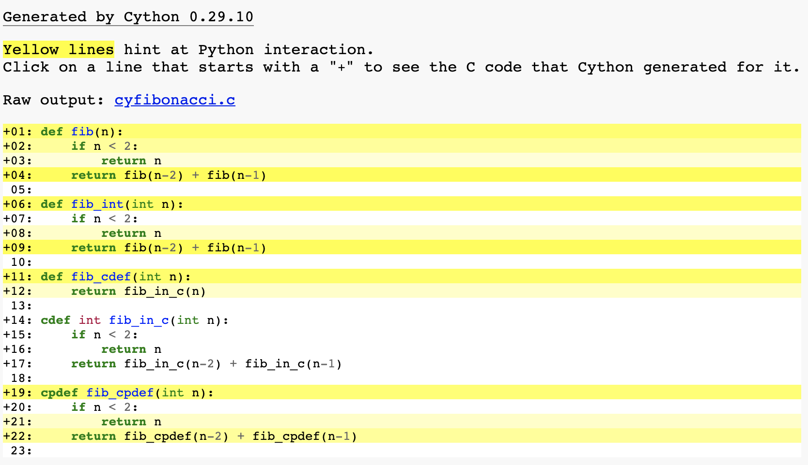

# Fibonacci (`def` vs `cdef` vs `cpdef`)

- `def` : "Basically, it's python!"
- `cdef` : "Basically, it's C!"
- `cpdef` : "It's Both."


### `pyfibonacci.py`

```python
def fib(n):
    if n < 2:
        return n
    return fib(n-2) + fib(n-1)
    
```


### `cyfibonacci.pyx`

```cython
def fib(n):
    if n < 2:
        return n
    return fib(n-2) + fib(n-1)

def fib_int(int n):
    if n < 2:
        return n
    return fib(n-2) + fib(n-1)

def fib_cdef(int n):
    return fib_in_c(n)

cdef int fib_in_c(int n):
    if n < 2:
        return n
    return fib_in_c(n-2) + fib_in_c(n-1)

cpdef fib_cpdef(int n):
    if n < 2:
        return n
    return fib_cpdef(n-2) + fib_cpdef(n-1)
    
```


## 성능 비교

```bash
$ python3 comparison.py
<function fib at 0x10e0888c8> 0.3334619998931885
<built-in function fib> 0.0830848217010498
<built-in function fib_int> 0.08296680450439453
<built-in function fib_cdef> 0.004754066467285156
<built-in function fib_cpdef> 0.02499103546142578
```

| function              | time(ms) | ratio|
| --------------------- | -------- | --------------------- |
| `pyfibonacci.fib(30)` | 0.3334   |70.93|
| `cyfibonacci.fib(30)` | 0.0830   |17.65|
| `cyfibonacci.fib_int(30)` | 0.0829 |17.63|
| **`cyfibonacci.fib_cdef(30)`** | 0.0047 |1.00|
| `cyfibonacci.fib_cpdef(30)` | 0.0249 |5.29|


## 코드 블록 분석을 위한 Cython 애너테이션

```Bash
$ cython -a cyfibonacci.pyx
```

위의 명령을 실행하면 `cyfibonacci.html` 파일이 생성된다. 그 파일을 브라우저로 확인해보면 아래와 같다.




코드의 각 줄을 누르면 생성된 C코드를 확인할 수 있다. 짙은 노란색은 파이썬 가상머신에서 더 많이 실행됐다는 것을 나타낸다. 옅은 노란색일 수록 파이썬이 아닌 C코드가 더 많음을 나타낸다. **노란색 코드를 가능한 줄여서 옅은 색이 더 많아지도록 하는 것이 목표가 된다.** 반복문 안에서의 노란색 줄을 해결하는 것이 의미가 훨씬 크다.


